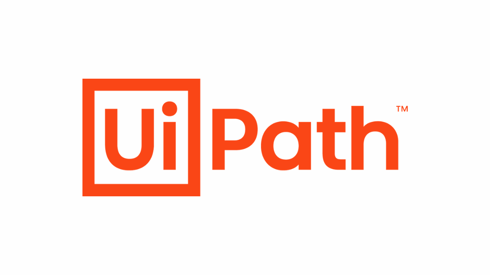

# Basic Automations by UiPath {:width="50%"}

## Content Projects INFO 

- At this repository I will share my UiPath automations, each folder will contain a project.
- At this stage I will not separate each project. For a while later projects topics will change and advanced topics will be different repositories. 
ENJOY IT ... 

## Step Project 

--> This project based on desktop automation for Github timline 
When we run this process it opens my github account and write a text in text.txt file which is into SecondTaskCAS repository. This Repository is Private. 
